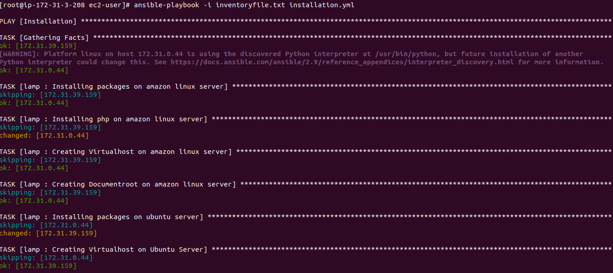

Installing and configuring Wordpress using Ansible playbook in RedHat and Debian based Distro's
=========

The infrastructure here includes one ansible master server and two ansible client servers(Ubuntu and Amazon linux). Ansible is installed in the Master server and using ansible playbook we will be installing and configuring Apache, MariaDB and Wordpress in the client servers.

Prerequisites:
---------

Install Ansible and verify the connection between Ansible server and client machine on which you need to automate tasks. Ansible can be installed using PIP or package manager.

- Install Ansible on your Master Machine

    - yum install ansible - Redhat based distribution

    - apt install ansible - Debian based distribution
    
    - amazon-linux-extras install ansible2 - on amazon-linux ec2 instances

 - Ansible Modules used

    - yum
    - service
    - copy
    - file
    - template
    - unarchive
    - command


Create roles for the tasks:
---------

Roles let you automatically load related vars, files, tasks, handlers, and other Ansible artifacts based on a known file structure. In this project i'm have created lamp role for installation and configuration of below the task. 

  - Install Apache webserver

  - Install PHP

  - Install MariaDB and Mysql database server

  - Creating a user account and setting up document root for domain

  - Creating domain virtual host

Roles can be created using init command.

> [root@ip-172-31-3-208 roles]# ansible-galaxy init lamp


These main tasks for lamp role are written to file lamp/tasks/main.yml

```

---

- name: "Installing packages on amazon linux server"
  when: ansible_os_family == "RedHat"
  yum:
    name: 
      - httpd
      - mariadb-server
      - MySQL-python  
    state: present
  notify:
    - httpd-restart


- name: "Installing php on amazon linux server"
  when: ansible_os_family == "RedHat"
  shell: "amazon-linux-extras install php7.4 -y"

- name: "Creating Virtualhost on amazon linux server"
  when: ansible_os_family == "RedHat"
  template:
    src: virtualhost.conf.j2
    dest: "/etc/httpd/conf.d/{{domain_name}}.conf"
  notify:
    - httpd-restart
    

- name: "Creating Documentroot on amazon linux server"
  when: ansible_os_family == "RedHat"
  file:
    path: "/var/www/html/{{ domain_name }}"
    state: directory
    owner: "{{ amazon_apache_user }}"
    group: "{{ amazon_apache_group }}"


- name: "Installing packages on ubuntu server"
  when: ansible_os_family == "Debian"
  apt:
    name:
      - apache2
      - mysql-server
      - php
      - php7.4-fpm 
      - libapache2-mod-php
      - php-mysql
      - python3-pip
      - python3-pymysql
    state: present
    update_cache: true
  notify:
    - apache2-restart
  
- name: "Creating Virtualhost on Ubuntu Server"
  when: ansible_os_family == "Debian"
  template:
    src: virtualhost.conf.j2
    dest: "/etc/apache2/sites-available/{{domain_name}}.conf"
        
- name: "Creating Documentroot on Ubuntu Server"
  when: ansible_os_family == "Debian"
  file:
    path: "/var/www/html/{{ domain_name }}"
    state: directory
    owner: "{{ ubuntu_apache_user }}"
    group: "{{ ubuntu_apache_group }}"
            
            
- name: "Restart and Enabling Services on Ubuntu Server"
  when: ansible_os_family == "Debian"
  service:
    name: "{{ item }}"
    state: restarted
    enabled: true
  with_items:
    - apache2
    - mysql
    - php7.4-fpm      
            
- name: "Copying .my.cnf on both servers"
  template:
    src: .my.cnf.j2
    dest: /root/.my.cnf
    owner: root
    group: root

- name : "Restarting mariadb"
  when: ansible_os_family == "RedHat"
  service:
    name: mariadb
    state: restarted
    enabled: true

- name: "Database server_root password setup on both servers"
  ignore_errors: true
  mysql_user:
    login_user: "root"
    login_password: ""
    user: "root"
    host_all: yes
    password: "{{ mysql_root_pass }}"

- name: "Removing anonymous user on Ubuntu Server"
  when: ansible_os_family == "Debian"
  mysql_user:
    config_file: "/root/.my.cnf"
    name: ''
    state: absent
    host_all: yes
    login_unix_socket: /var/run/mysqld/mysqld.sock
            
- name: "Removing test Database on Ubuntu Server"
  when: ansible_os_family == "Debian"
  mysql_db:
    config_file: "/root/.my.cnf"
    name: test   
    state: absent
    login_unix_socket: /var/run/mysqld/mysqld.sock
            
- name: "Creating wordpress database on Ubuntu Server"
  when: ansible_os_family == "Debian"
  mysql_db:
    config_file: "/root/.my.cnf"
    name: "{{ mysql_db_name }}"
    state: present
    login_unix_socket: /var/run/mysqld/mysqld.sock

- name: "Creating wordpress user and setting up Privileges on Ubuntu Server"
  when: ansible_os_family == "Debian"
  mysql_user:
    config_file: "/root/.my.cnf"
    name: "{{ mysql_db_user }}"
    state: present
    password: "{{ mysql_db_pass }}"
    priv: "{{ mysql_db_name }}.*:ALL"
    login_unix_socket: /var/run/mysqld/mysqld.sock

            
- name: "Removing anonymous user on Amazon linux Server"
  when: ansible_os_family == "RedHat"
  mysql_user:
    config_file: "/root/.my.cnf"
    host_all: yes
    name: ""
    state: absent
            
- name: "Removing test Database on Amazon linux Server"
  when: ansible_os_family == "RedHat"
  mysql_db:
    config_file: /root/.my.cnf     
    name: test   
    state: absent
            
- name: "Creating wordpress database on Amazon linux Server"
  when: ansible_os_family == "RedHat"
  mysql_db:
    config_file: /root/.my.cnf
    name: "{{ mysql_db_name }}"
    state: present
            
- name: "Creating wordpress user and setting up Privileges on Amazon linux Server"
  when: ansible_os_family == "RedHat"
  mysql_user:
    config_file: /root/.my.cnf
    name: "{{ mysql_db_user }}"
    state: present
    password: "{{ mysql_db_pass }}"
    priv: "{{ mysql_db_name }}.*:ALL"
            
- name: "Restarting db on ubuntu"        
  when: ansible_os_family == "Debian"
  service:
    name: mysql
    state: restarted
    enabled: true
  notify:
    - apache2-restart
        
- name: "Restarting db amazon"
  when: ansible_os_family == "RedHat"
  service:
    name: mariadb
    state: restarted
    enabled: true
  notify:
    - httpd-restart

```

Variables for lamp role:


Variables for this role is declared in file lamp/vars/main.yml    

```

---

ubuntu_apache_user: "www-data"
ubuntu_apache_group: "www-data"
amazon_apache_user: "apache"
amazon_apache_group: "apache"

wp_url: "https://wordpress.org/latest.tar.gz"
domain_name: "www.example.com"
httpd_port: "80"

mysql_db_name: "wordpress"
mysql_db_user: "wordpress"
mysql_db_pass: "wordpress"
mysql_root_pass: "mysqlroot@123"

```

Adding handlers to playbook

Handlers are tasks that only run when notified. Handlers are used in this project to restart apache webserver whenever configuration of this service got changed by task, notifydirective is used for this. In the lamp/tasks/main.yml file you can see notify directive is used when ever those taks modify this service configuration. Regardless of how many tasks notify a handler, it will run only once, after all of the tasks completed in a playbook.

Handlers tasks are written to lamp/handlers/main.yml file

```
---

- name: "httpd-restart"
  when: ansible_os_family == "RedHat"
  service:
    name: httpd
    state: restarted
    enabled: true

- name: "apache2-restart"
  when: ansible_os_family == "Debian"
  service:
    name: apache2
    state: restarted
    enabled: true
    
```

Adding Templates

We have added httpd.conf, virtualhost and my.cnf templates in this folder these files will be placed in client server on execution of playbook via template module.


Sample Playbook
----------------

```
---

- name: "Installation"
  hosts: all
  become: true
  roles:
    - lamp
  vars:
    - ubuntu_apache_user: "www-data"
    - ubuntu_apache_group: "www-data"
    - amazon_apache_user: "apache"
    - amazon_apache_group: "apache"
    - wp_url: "https://wordpress.org/latest.tar.gz"
    - domain_name: "www.example.com"
   
  tasks:
    
    - name: "Wordpress download on both server"
      unarchive:
        src: "{{ wp_url }}"
        dest: /tmp/
        remote_src: yes
         
    - name: "Moving Files to Ubuntu server"
      when: ansible_os_family == "Debian"
      copy:
        src: "/tmp/wordpress/"
        dest: "/var/www/html/{{ domain_name }}/"
        owner: "{{ ubuntu_apache_user }}"
        group: "{{ ubuntu_apache_group }}"
        remote_src: yes
    
    - name: "Moving Files to Amazon linux server"
      when: ansible_os_family == "RedHat"
      copy:
        src: "/tmp/wordpress/"
        dest: "/var/www/html/{{ domain_name }}/"
        owner: "{{ amazon_apache_user }}"
        group: "{{ amazon_apache_group }}"
        remote_src: yes

            
    - name: "Creating wp-config.php on ubuntu"
      when: ansible_os_family == "Debian"
      template:
        src: wp-config.php.j2
        dest: "/var/www/html/{{ domain_name }}/wp-config.php"
        owner: "{{ ubuntu_apache_user }}"
        group: "{{ ubuntu_apache_group }}"
  
    - name: "Creating wp-config.php on amazon linux server"
      when: ansible_os_family == "RedHat"
      template:
        src: wp-config.php.j2
        dest: "/var/www/html/{{ domain_name }}/wp-config.php"
        owner: "{{ amazon_apache_user }}"
        group: "{{ amazon_apache_group }}"
             
    - name: "deleting unwanted files from both servers"
      file:
        path: /tmp/wordpress
        state: absent

    
    - name: "Enabling virtualhost"
      when: ansible_os_family == "Debian"
      shell: "a2ensite {{ domain_name }}.conf"

    - name: "Disabling old one"
      when: ansible_os_family == "Debian"
      shell: "a2dissite 000-default.conf"


    - name: "Reloading Apache"
      when: ansible_os_family == "Debian"
      service:
        name: apache2
        state: reloaded

    - name: "Reloading Apache"
      when: ansible_os_family == "RedHat"
      service:
        name: httpd
        state: reloaded 
```

Outputs
-------




Conclusion
----------

Using the steps in this document i have setup lamp and deploy wordpress on ubuntu and amazon-linux using ansible playbook. Using ansible we can run the tasks on mulitple targets server, it will be easy, error free and saves much time when compared to performing this setups manually in multiple target servers.

